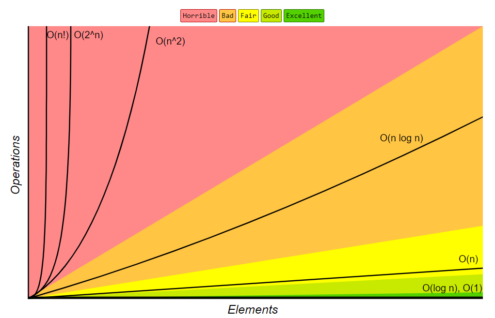

### Time & Space Complexity
Complexity matching is basically calculating number of operations performed to achieve the same business logic. Makes it independent of machine specifics. It is a good methodology to compare two piece of code. There are three notations : Omega (Best Case), Theta (Average Case), Omicron (Worst Case). We drop constants, ignore less complexity part of code, take the dominant part as the complexity. Use different terms for parameters, don't take O(a + b) as O(n).

